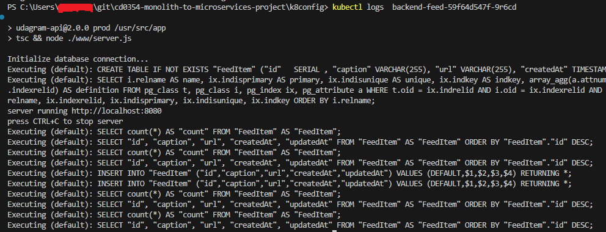

# Screenshots
To help review your infrastructure, please include the following screenshots in this directory::

## Deployment Pipeline

I used GitHub Actions for the deployment pipeline. The screenshots below show the successful deployment of the application.

* DockerHub showing containers that you have pushed


* GitHub repository action logs


* Github Actions in VSCode


## Kubernetes
* To verify Kubernetes pods are deployed properly
```bash
kubectl get pods
```


* To verify Kubernetes services are properly set up
```bash
kubectl describe services
```


* To verify that you have horizontal scaling set against CPU usage
```bash
kubectl describe hpa
```


* To verify that you have set up logging with a backend application
```bash
kubectl logs {pod_name}
```


